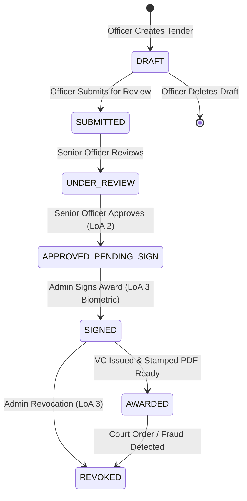

# 🏛️ Government Tender Verification & e-Signing System

[](https://frontend-six-blush-87.vercel.app)
[](https://frontend-six-blush-87.vercel.app/verify)
[](https://government-tender-verification-and-e.onrender.com)
[](https://opensource.org/licenses/MIT)

> **A court-admissible, tamper-evident e-procurement lifecycle platform** built for government departments. Incorporates **MOSIP eSignet** for identity assurance, **W3C Verifiable Credentials (VC)** for cryptographic award issuance, automated **PAdES-compliant PDF stamping** with high-density QR encoding, and real-time revocation checking via **W3C Bitstring Status Lists**.

---

## 🌐 Live Deployments

| Component | Service | Direct Link |
| :--- | :--- | :--- |
| **Official Portal & Login** | Vercel | [https://frontend-six-blush-87.vercel.app](https://frontend-six-blush-87.vercel.app) |
| **Public QR Verification** | Vercel | [https://frontend-six-blush-87.vercel.app/verify](https://frontend-six-blush-87.vercel.app/verify) |
| **Core API & Engine** | Render | [https://government-tender-verification-and-e.onrender.com](https://government-tender-verification-and-e.onrender.com) |

> 💡 **Demo / Evaluator Quick Login:** Visit the portal, choose your role (`OFFICER` or `ADMIN`), and click **"Sign In as Demo Official"** to explore the complete workflow without requiring physical biometric scanners.

---

## ✨ Key Capabilities

### 1. 🔐 High-Assurance Identity (MOSIP eSignet)
* **OpenID Connect (OIDC) with PKCE**: Cryptographically hardened authentication against identity spoofing and token interception.
* **Level of Assurance (LoA) Tiering**:
  * **LoA 2 (OTP / Demographic)**: Required for basic drafting, submissions, and initial reviews.
  * **LoA 3 (Biometric Fingerprint / Iris)**: Strictly enforced at the database and middleware layers before tender award signing or revocation can execute.
* **Replay Attack Defense**: Nonce tracking and single-use JTI verification.

### 2. 📜 W3C Verifiable Credentials & PixelPass QR
* **Cryptographic Awards**: Issues signed W3C-compliant Verifiable Credentials adhering to the W3C VC Data Model 1.1 / 2.0.
* **PixelPass QR Generation**: High-density QR codes generated with **Level H error correction** (up to 30% document damage resilience).
* **Asynchronous PDF Stamping**: Award letters are dynamically generated, signed, and stamped with tamper-evident QR codes in non-blocking worker threads.

### 3. 🚫 Instant Revocation (Bitstring Status List)
* **W3C Bitstring Status List**: Efficient, privacy-preserving credential revocation registry.
* **Sub-Second Revocation**: When an administrative revocation occurs, the status bit is flipped and synced, instantly alerting verification endpoints without exposing bidder history.

### 4. 🛡️ Tamper-Proof Audit Trail
* **Append-Only Ledger**: PostgreSQL trigger-guarded audit table where `UPDATE` and `DELETE` operations are strictly blocked at the database engine level.
* **Court-Admissible Forensics**: Captures IP addresses, timestamps, actor roles, old/new states, and SHA-256 document checksums.

---

## 🔄 Tender Lifecycle State Machine



---

## 🛠️ Technology Stack

| Layer | Technologies |
| :--- | :--- |
| **Frontend** | React 18, Vite, Tailwind CSS, Lucide Icons, TanStack Query (React Query), Axios |
| **Backend** | Node.js (ESM), Express.js, Worker Threads |
| **Database & Cache** | PostgreSQL 16, connect-pg-simple session store, Redis (optional / with fallback) |
| **Cryptography & Standards** | JOSE, @mosip/pixelpass, W3C Verifiable Credentials, PDF-Lib, node-signpdf |
| **Cloud Deployment** | Vercel (Frontend SPA & Routing), Render (Backend Web Service & Managed PostgreSQL) |
| **Containerization** | Docker, Docker Compose |

---

## 🚀 Quick Start (Local Development)

### 1. Clone the Repository
```bash
git clone https://github.com/evan-chemmannur/Government-Tender-Verification-and-e-Signing-system.git
cd Government-Tender-Verification-and-e-Signing-system
```

### 2. Launch Local Infrastructure (Docker)
```bash
docker-compose up -d db redis
```

### 3. Configure Environment Variables
```bash
cp .env.example .env
```

### 4. Setup & Start Backend
```bash
cd backend
npm install
npm run migrate    # Executes database migrations (001 - 012)
npm run dev        # Starts server on http://localhost:3001
```

### 5. Setup & Start Frontend
Open a new terminal:
```bash
cd frontend
npm install
npm run dev        # Starts Vite on http://localhost:3000
```

---

## 🔍 Public QR & Credential Verification Flow

Anyone can verify an award letter without logging in:

1. Navigate to the **[Public Verification Portal](https://frontend-six-blush-87.vercel.app/verify)**.
2. Hold the stamped PDF up to your webcam, scan the QR code, or upload the downloaded award document.
3. The cryptographic verification engine checks:
   - ✅ **Structural Schema**: Validates W3C JSON-LD context and fields.
   - ✅ **Issuer Identity**: Resolves official DID registry.
   - ✅ **Signature Integrity**: Verifies cryptographic seal against the government public key.
   - ✅ **Revocation Check**: Queries the live Bitstring Status List.
   - ✅ **Date Validity**: Confirms contract start and end windows.
4. Returns instant verdict: **`GENUINE`**, **`TAMPERED`**, or **`REVOKED`**.

---

## 🔒 Security & Hardening Highlights

* **CSRF Synchronizer Token Pattern**: Dual-token protection on all mutating HTTP routes (`POST`, `PUT`, `DELETE`).
* **Cross-Site Cookie Isolation**: Configured with `SameSite=None` and `Secure` with reverse proxy trust for cross-cloud interoperability between Vercel and Render.
* **SQL Injection & XSS Immunity**: Parameterized queries via `node-postgres` and strict input sanitization.
* **Database Constraint Guards**: Immutable foreign key isolation on forensic audit entries.

---

## 👥 Roles & Permissions Matrix

| Capability | OFFICER | SENIOR_OFFICER | ADMIN | PUBLIC |
| :--- | :---: | :---: | :---: | :---: |
| Create & Edit Drafts | ✅ | ✅ | ✅ | ❌ |
| Delete Drafts | ✅ | ✅ | ✅ | ❌ |
| Submit for Review | ✅ | ✅ | ✅ | ❌ |
| Start Review | ❌ | ✅ | ✅ | ❌ |
| Approve Tender | ❌ | ✅ (LoA 2) | ✅ (LoA 2) | ❌ |
| Biometric e-Sign Award | ❌ | ❌ | ✅ (LoA 3) | ❌ |
| Revoke Awarded Tender | ❌ | ❌ | ✅ (LoA 3) | ❌ |
| Access Audit Logs | ❌ | ❌ | ✅ | ❌ |
| Verify QR Code | ✅ | ✅ | ✅ | ✅ |

---

## 📄 License
This project is open-source software licensed under the [MIT License](LICENSE).
